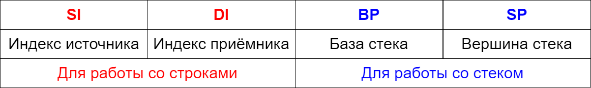

###### _Лекции по курсу "Системное программирование"  МГТУ им. Баумана кафедра ИУ5_

# Системное программирование<!-- omit in toc -->

## План <!-- omit in toc -->

- [1. Терминология](#1-терминология)
- [2. Исторический экскурс. Различные архитектуры ЦП.](#2-исторический-экскурс-различные-архитектуры-цп)
- [3. Основные понятия](#3-основные-понятия)
- [4. Трансляторы ассемблеров, диалекты.](#4-трансляторы-ассемблеров-диалекты)
- [5. Быстрый старт](#5-быстрый-старт)
- [6. Режимы работы с памятью](#6-режимы-работы-с-памятью)
- [7. Регистры](#7-регистры)
  - [**Основные регистры** процессоров Intel](#основные-регистры-процессоров-intel)
  - [**Регистры-указатели**](#регистры-указатели)
  - [**Сегментные регистры** и Сегментация памяти](#сегментные-регистры-и-сегментация-памяти)
  - [**Регистр флагов**](#регистр-флагов)
- [8. Цикл выполнения команды](#8-цикл-выполнения-команды)
- [9. Организация памяти](#9-организация-памяти)
- [Системы счисления](#системы-счисления)

## 1. Терминология

**`Машинный код`** – система команд конкретной вычислительной машины (процессора), которая интерпретируется непосредственно процессором. Команда, как правило, представляет собой целое число, которое записывается в регистр процессора. Процессор читает это число и выполняет операцию, которая соответствует этой команде.

**`Язык программирования низкого уровня`** (низкоуровневый язык программирования) – это язык программирования, максимально приближённый к программированию в машинных кодах. В отличие от машинных кодов, в языке низкого уровня каждой команде соответствует не число, а сокращённое название команды (мнемоника). Например, команда ADD – это сокращение от слова ADDITION (сложение). Поэтому использование языка низкого уровня существенно упрощает написание и чтение программ (по сравнению с программированием в машинных кодах). Язык низкого уровня привязан к конкретному процессору. Например, если вы написали программу на языке низкого уровня для процессора PIC, то можете быть уверены, что она не будет работать с процессором AVR.

**`Язык программирования высокого уровня`** – это язык программирования, максимально приближённый к человеческому языку (обычно к английскому, но есть языки программирования на национальных языках, например, язык 1С основан на русском языке). Язык высокого уровня практически не привязан ни к конкретному процессору, ни к операционной системе (если не используются специфические директивы).

**`Язык ассемблера`** – это низкоуровневый язык программирования, на котором вы пишите свои программы. Для каждого процессора существует свой язык ассемблера.

**`Ассемблер`** – это специальная программа, которая преобразует (компилирует) исходные тексты вашей программы, написанной на языке ассемблера, в исполняемый файл (файл с расширением EXE или COM). Если быть точным, то для создания исполняемого файла требуются дополнительные программы, а не только ассемблер.

В большинстве случаев говорят «ассемблер», а подразумевают «язык ассемблера».

>**ВАЖНО!**
>В отличие от языков высокого уровня  для КАЖДОГО АССЕМБЛЕРА существует СВОЙ ЯЗЫК АССЕМБЛЕРА. Это правило в корне отличает язык ассемблера от языков высокого уровня. Исходные тексты программы (или просто «исходники»), написанные на языке высокого уровня,  большинстве случаев можете откомпилировать разными компиляторами для разных процессоров и разных операционных систем. С ассемблерными исходниками это сделать будет намного сложнее. Конечно, эта разница почти не ощутима для разных ассемблеров, которые предназначены для одинаковых процессоров. Но для КАЖДОГО ПРОЦЕССОРА существует СВОЙ АССЕМБЛЕР и СВОЙ ЯЗЫК АССЕМБЛЕРА. В этом смысле программировать на языках высокого уровня гораздо проще. Однако за все удовольствия надо платить. В случае с языками высокого уровня мы можем столкнуться с такими вещами как больший размер исполняемого файла, худшее быстродействие и т.п.

На этом курсе изучаем программировании для компьютеров с процессорами Intel (или совместимыми).

## 2. Исторический экскурс. Различные архитектуры ЦП.

Исторически сложилось так, что практически все процессоры, которыми мы пользовались, называются процессорами x86.

Архитектура **x86** обозначает большое семейство процессоров как с 16-битной, так и с 32-битной архитектурой набора команд. История x86 началась с выходом процессора Intel 8086 в 1978 году. В 1979 году выходит функционально похожий на 8086 процессор Intel 8088. Последующие поколения этой серии процессоров получили названия 80186, 80286, 80386 и 80486, что привело к возникновению термина «x86» как сокращению для семьи процессоров. В последствии процессоры и серии процессоров Intel, которые представляли эту архитектуру, имели совершенно другие имена, например, серии Pentium, Celeron и т.д., но они принадлежали также к этой архитектуре.

Кроме компании Intel процессоры на архитектуре x86 также выпускала компания AMD, в частности, это серии процессоров Athlon, Duron и т.д.

Процессоры 8086 и 8088 были 16-битными, несмотря на 8-битную шину данных в 8088. Регистры в этих процессорах имели разрядность 16 бит, а набор инструкций работал с 16-битными данными. 8086 и 8088 не поддерживали многие функции современных процессоров, например, виртуальную память и уровни защиты. Эти процессоры имели 20 адресных линий, что ограничивало размер используемой память 1 мегабайтом. Но 20-битный адрес не мог поместиться в 16-битный регистр, поэтому для работы с адресами необходимо было использовать систему сегментных регистров и смещений для доступа к полному адресному пространству размером 1 МБ.

В 1985 году компания Intel выпустила процессор 80386, который был важным шагом вперед в развитии архитектуры x86. Этот процессор был 32-битным. И адреса, регистры и АЛУ также имели разрядность в 32 бита, а инструкции изначально работали с операндами размером до 32 бит. Кроме того, он использовал защищенный режим (protected mode), в котором был реализан многоуровневый механизм привилегий из трех уровней - от 0 до 3. Уровень 0 представлял уровень с максимальными правами и предназначался для ядра операционной системы, тогда как уровень 3 предназначался для прикладных пользовательских программ. Уровни 1 и 2 - промежуточные. Стоит отметить, что операционные системы Windows и Linux до сих пор реализуют только 2 уровня - 0 и 3. 80386 поддерживал память размером 4 ГБ, в которой адреса были 32-битными, а манипуляции с сегментными регистрами и смещениями больше не требовались. Кроме того, была добавлена поддержка выгружаемой виртуальной памяти.

После этого процессоры данной архитектуры стали 32-битными.

Архитектура x86 имеет порядок следования байтов от младшего к старшему (little-endian) что означает, что многобайтовые значения хранятся в памяти с младшим значащим байтом по младшему адресу и старшим значащим байтом по старшему адресу.

Архитектура х64 изначально представляла расширение процессора x86 и его набора инструкций до 64 бит. Первая спецификация этой архитектуры назвалась AMD64 и была представлена компанией AMD в 2000 году. Первый процессор AMD64, Opteron, был выпущен в 2003 году.

Компания Intel паралелльно развивала собственную 64-разрядную архитектуру, которая называлась IA-64 и которая была несовместима с х86. Результатом развития этой архитектуры стал процессор Itanium, который вышел в 2001 году. Однако затем Intel решили пойти по пути AMD и также стали развивать 64-разрядную архитектуру как расширение для x86, к тому же совместимую с AMD64, получившую название Intel 64. Первым процессором Intel на 64-разрядной архитектуре стал Xeon, который вышел в 2004 году. В конечном счете эта архитектура стала называться **x86-64**, отражая эволюцию x86 до 64 бит, и, как правило, для ее названия употребляется сокращение **x64**. Стоит отметить, что первая версия операционной системы Linux, которая поддерживала архитектуру x64, была выпущена в 2001 году. ОС Windows начала поддерживать архитектуру x64 в 2005 году.

Процессоры, которые реализуют архитектуры AMD64 и Intel 64, в значительной степени совместимы на уровне набора инструкций программ пользовательского режима. Между архитектурами есть несколько различий. Как правило, компиляторы операционных систем и языков программирования управляют этими различиями, что делает их редкой проблемой для разработчиков прикладного программного обеспечения. Разработчики же системного программного обеспечения ядра, драйверов и ассемблерного кода должны учитывать эти различия.

<!--Основные особенности архитектуры x64:

-   x64 — это совместимое 64-битное расширение 32-битной архитектуры x86, и большинство программ, особенно прикладных приложений, написанных для 32-битной среды, должны выполняться без изменений на 64-битном процессоре.

-   Восемь 32-битных регистров общего назначения x86 расширены до 64 бит в процессорах x64. Префикс имени регистра R указывает на 64-битные регистры. Например, в x64 расширенный регистр x86 EAX называется RAX. Подкомпоненты регистра x86 EAX, AX, AH и AL по-прежнему доступны в x64.

-   Архитектура x64 реализует практически тот же набор инструкций, что и x86. При работе в 64-битном режиме архитектура x64 по умолчанию размер адреса - 64 бита, а размер операнда - 32 бита.

-   Указатель инструкций, RIP, теперь 64-битный. Регистр флагов, RFLAGS, также расширяется до 64 бит, хотя старшие 32 бита зарезервированы. Младшие 32 бита RFLAGS аналогичны EFLAGS в архитектуре x86.

-   Добавлено восемь 64-битных регистров общего назначения с именами от R8 до R15.

-   Добавлена встроенная поддержка для 64-битных целых чисел.


Процессоры x64 сохраняют возможность работы в режиме совместимости с x86. Этот режим позволяет использовать 32-разрядные операционные системы и позволяет любому приложению, созданному для x86, работать на процессорах x64. В 32-битном режиме совместимости 64-битные расширения недоступны.
-->

Архитектура процессоров Intel x86-64 является на сегодняшний день доминирующей архитектурой для различного рода устройств - настольных компьютеров, ноутбуков, серверов.

В тоже время для мобильных устройств используется другая архитектура процессоров: **ARM** является сокращением от "Advanced RISC Machine". Процессор ARM изначально был разработан в компании Acorn Computers (Великобритания), который, по мысли разработчиков, должен был сменить процессор BBC Microcomputer, который использовался в образовательных целях. Для разработки инженеры Acorn решили использовать технологию RISC (reduced instruction set computer). По сравнению с господствовашей тогда архитектурой CISC (complex instruction set computer), которая применялась в процессорах Intel, архитектура RISC позволяла снизить объем используемого в чипах кремния. Что в итоге вело к удешевлению производства и, кроме того, приводило к уменьшению энергопотребления. Это в свою очередь повлияло на то, что компания Apple выбрала ARM-процессор для своего устройства - iPod. И впоследствии большинство смартфонов и планшетов стали использовать процессоры на архитектуре ARM.

**Кроме архитектуры есть такое понятие как профили.**

Существуют три профиля:

A: профиль «приложения» (application) (например, Armv8-A). Данный профиль предназначен для многофункциональных операционных систем, используемых в таких устройствах, как мобильные телефоны, устройства IoT, ноутбуки и серверы.

R: профиль «реального времени» (например, Armv8-R). Предназначен для систем реального времени или систем, критически важных для безопасности, таких как медицинские устройства, авионика и электронные тормоза в транспортных средствах. Процессоры R-профиля выполняют 32-битный код и поддерживают гораздо более ограниченную архитектуру памяти по сравнению с A-профилем.

M: профиль «микроконтроллера» (например, Armv8-M). Предназначен для микроконтроллеров, применяемых во встраиваемых системах, таких как промышленные устройства и некоторые устройства IoT.

Название профиля обычно прибавляется через дефис к версии архитектуры, например, Armv8-A - здесь A как раз указывает на профиль.

## 3. Основные понятия


При программировании на низком уровне приходится сталкиваться и учитывать все особенности архитектуры. Поэтому основным понятием является **`центральный процессор (ЦП)`** - важнейшая часть любой компьютерной системы, которая выполняет все основные вычислительные действия. В каждый момент времени ЦП выполняет инструкцию или машинную команду - фактически это обычное число, которое хранится в памяти, за которым закреплено определенное действие ЦП. Набор таких действий ЦП довольно ограничен и связан с возможностью манипулирования имеющимися в распоряжении ЦП ресурсами. С этими ресурсами ЦП связан специальной системной шиной, которая сама по себе делится на три части: **`шина адреса`**, **`шина данных`**, **`шина управления`**. К доступным ресурсам относятся системная память и внешние устройства (жесткий диск, монитор и т.д.). Однако взаимодействие ЦП с внешними устройствами происходит опосредовано через **`контроллеры`** - контроллер ввода-вывода, контроллер прерываний, USB-контроллер, контроллер прямого доступа к памяти. Контроллеры позволяют корректно интерпретировать поступающую от ЦП информацию для конкретного внешнего устройства.

Важнейшая составляюшая любой системы - **`оперативная память`**, она делится на два вида: **`физическая`**, **`линейная`**. Адреса физической памяти характеризуют реальное расположение данных в физической памяти (физические адреса). Набор физических адресов, с которым работает программа, называют физическим адресным пространством. Линейная память - это логическая адресация памяти - массив байт без определенной структуры.

Процессор тоже имеет свою память двух видов: **`кэш-память`** и **`регистровую память`**. Кэш-память - это такая же оперативная память, только находящаяся внутри кристала процессора (поэтому доступ к ней ЦП существенно быстрее). Физически различия все же есть: кэш-память - более дорогая статическая (отсутствуют процессы регенерации - построена на триггерах, которые не нужно подзаряжать), основная память - более дешевая динамическая, построена по принципу конденсатора, заряд которого приходится переодически обновлять (регенерировать). Кэш-память всегда является копией основной памяти, к которой ЦП часто обращается.

Регистровая память включает в себя множество регистров. Регистр - это ячейка памяти внутри процессора, которая хранит некоторое число определенной разрядности. В зависимости от архитектуры процесора регистры бывают разной разрядности: 8, 16, 32, 64 разрядные. Фактически регистры - это руки процессора, чтобы что-то сделать с числами, они должны попасть в регистры процессора.

Те регистры, которые могут хранить любую информацию, называются **`регистрами общего`** назначения (РОН), другие регистры могут хранить только определенную информацию, они называются **`регистрами специального назначения`** (РСН).

Инструкция может выполняться от одного до нескольких десятков **`процессорных тактов`**.

Внутри ЦП также находится специальный модуль, отвечающий за выполнение арифметических и логических действий - **`арифметико-логическое устройство (АЛУ)`**. АЛУ реализует алгоритмы сложения, умножения, сравнения чисел и т.д.

Ещё одно важное понятие – это **`стек`**. Стек – это специальная область памяти, которая используется для хранения промежуточных данных.

## 4. Трансляторы ассемблеров, диалекты.

Проблема выбора "единственно правильного" ассемблерного транслятора мучает не только начинающих, но и профессиональных программистов. На текущий момент наиболее популярные ассемблеры: [MASM](https://ru.wikipedia.org/wiki/MASM), [TASM](https://ru.wikipedia.org/wiki/TASM), [GAS](https://ru.wikipedia.org/wiki/GNU_Assembler), [FASM](https://ru.wikipedia.org/wiki/Fasm), [NASM](https://ru.wikipedia.org/wiki/NASM), [YASM](https://ru.wikipedia.org/wiki/Yasm).

Ниже приведено описание основных трансляторов.

**Microsoft Macro Assembler (MASM)**

Ассемблер Microsoft Macro Assembler или сокращенно MASM является одним из старейших развиваемых ассемблеров (первая версия вышла в 1981 году). Его развивает компания Microsoft. MASM доступен в рамках такого инструмента для разработки приложений, как Visual Studio. Преимуществом MASM является то, что MASM использует для своих инструкций синтаксис Intel. Недостатком MASM является наличие официальной поддержки только для ОС Windows.

Стоит отметить, что также существует неофициальный сайт, посвященный MASM, где можно найти дополнительную информацию по данному ассемблеру - [https://www.masm32.com/](https://www.masm32.com/)

**`Turbo Assembler (TASM)`**

TASM (Turbo Assembler) — ассемблер компании Borland, созданный для разработки программ под процессоры x86. Он появился в конце 1980-х годов и получил широкое распространение в эпоху DOS. TASM поддерживал синтаксис Intel, поэтому исходный код выглядел привычно для программиста x86. Одной из особенностей TASM был режим совместимости с MASM. Поэтому многие программы, написанные под MASM, можно было собирать с помощью TASM с небольшими или вообще без изменений.

**GNU Assembler (GAS)**

Ассемблер GNU Assembler или сокращенно GAS поставляется как компонент набора компиляторов GCC. Поскольку компиляторы GCC довольно распространены и являются кроссплатформенными, то GAS соответственно также можно использовать на разных платформах. Из недостатков можно отметить, что GAS использует синтаксис, отличный от синтаксиса Intel (а именно синтаксис AT&T). Хотя последние версии GCC включают параметр «-masm», который при значении "-masm=intel" позволяет встраивать код ассемблера с использованием синтаксиса Intel. Эквивалентным параметром для GAS является "-msyntax=intel" или использование директивы ".intel_syntax".

**Netwide Assembler (NASM)**

Netwide Assembler или NASM развивается как opensource-проект и использует синтаксис, который похож на синтаксис Intel. Является кросс-платформенным и работает почти на любой платформе. Официальный сайт проекта - [https://www.nasm.us/](https://www.nasm.us/)

**Flat Assembler (FASM)**

Flat Assembler (FASM) является кросс-платформенным и поддерживает основные ОС (Linux, Windows и MacOS). Тоже развивается как проект open source. Используемый синтаксис похож на NASM. Примечателен тем, что написан на самом FASMe и имеет специальную небольшую IDE для написания программ. Официальный сайт проекта - [https://flatassembler.net/](https://flatassembler.net/)

**YASM**

YASM - это полностью переработанный ассемблер NASM под «новой» лицензией BSD. YASM позволяет использовать синтаксисы **NASM** (Netwide Assembler) и **GAS** (GNU Assembler). Как и NASM, является кросс-платформенным. Официальный сайт - [https://yasm.tortall.net/](https://yasm.tortall.net/)

## 5. Быстрый старт

Ассемблеры MASM, TASM и WASM отличаются между собой. Однако создание простых программ для них практически не имеет отличий, за исключением самого ассемблирования и компоновки.
Итак, наша первая программа для MASM, TASM и WASM, которая выводит английскую букву 'A' в текущей позиции курсора, то есть в левом верхнем углу экрана:

```asm
MYCODE SEGMENT 'CODE'
    ASSUME CS:MYCODE

LET  DB 'A'
START:
; загрузка сегментного регистра данных DS
     PUSH CS
     POP  DS
; вывод одного символа на экран
     MOV AH, 02
     MOV DL, LET
     INT 21H
; выход из программы
     MOV AL, 0
     MOV AH, 4CH
     INT 21H
MYCODE ENDS
END START
```

`MYCODE SEGMENT 'CODE'` - *Создаётся сегмент с именем MYCODE*,

где:

- MYCODE  —    *имя сегмента;*
- SEGMENT —    *начало описания сегмента;*
- 'CODE'  —    *имя класса сегмента. Обычно таким классом обозначают сегмент кода.*

`ASSUME CS:MYCODE` - *это директива ассемблера*, а не инструкция процессора. Она говорит ассемблеру: что регистр CS у процессора содержит адрес сегмента MYCODE.

>Важно: `ASSUME` не загружает ничего в CS.

Процессор эту строку вообще не выполняет. Она нужна ассемблеру, чтобы он правильно формировал адреса и проверял обращения к сегментам.

**Ассемблирование в `TASM`**

Для TASM создаём объектный файл с именем `first.obj`, набрав в командной строке

```bash
tasm first.asm
```

Далее следует скомпоновать полученный файл `first.obj` в исполняемый файл `first.exe`.

```bash
tlink /t /x first.obj
```

Теперь можно ее запустить

```bash
first
```

в результате буква «A» отразится в левом верхнем углу экрана.

## 6. Режимы работы с памятью

В 70-х годах прошлого века компьютер с памятью 64 Кб считался суперкомпьютером. Для адресации такой памяти хватало 16 бит. После того как появились модули памяти 128 Кб и даже 256 Кб, регистров размером 16 бит стало не хватать для адресации памяти. Тогда ввели 16-битные сегментные регистры. Вся память делилась на сегменты размером 64 Кб. Сегмент задавался сегментным регистром, а адрес – обычным регистром или непосредственно 16-битным значением адреса. Но даже после этих новаций можно было адресовать только 1 Мб физической памяти из-за особенности формирования физического адреса и особенностей архитектуры процессора.

Всё кардинально изменилось, когда был выпущен первый полноценный 32-разрядный процессор (Intel 80386): он мог работать в двух режимах – в обычном 16-разрядном, как старые процессоры, и в защищённом, в котором можно было адресовать до 4 Гб физической памяти. На процессоре Intel 80386 появились новые 32-разрядные регистры, с помощью которых можно было адресовать эту память; также он поддерживал набор команд, позволяющий работать с данными размером 32 бита. Сегментные регистры остались, но они не слишком сильно влияли на формирование адреса, а предназначались для защиты определённых областей памяти, которые могла задавать операционная система; отсюда и название этого режима. Впрочем, для того чтобы получить доступ к 4 Гб памяти, необязательно надо было переходить в защищённый режим: такая возможность существовала и в режиме реальных адресов, но защищённый режим давал намного больше новых возможностей, чем просто расширение физического адресного пространства до 4 Гб.

После выпуска первых процессоров с поддержкой технологии AMD64 появился и 64-битный режим, который являлся вариантом защищённого режима, рассчитанным только на 64-битную архитектуру. В нём важность сегментных регистров была снижена до минимума, а защита данных операционной системы полностью возложена на механизм трансляции страниц.

Существует три вида адресов:

- Физический.
- Линейный (или виртуальный).
- Логический.

**`Физический адрес`** – это адрес в системной памяти компьютера, именно тот адрес, который выставляется на шину адреса.

Для того чтобы получить доступ к некоторому значению в памяти (в любом режиме), приложение должно указать сегмент и адрес в этом сегменте. Сегмент указывается в сегментном регистре или непосредственно значением (это значение может быть только 16-битным), а адрес – в обычном регистре или непосредственно значением (это значение может быть 16-, 32-, 64-битным в зависимости от режима). Приложение может указать адрес разными способами, а сегмент можно вовсе не указывать. Если он не указан, то значение сегмента берётся из соответствующего (код, данные или стек) сегментного регистра.

Адрес всегда будет в таком формате – «сегмент:смещение»; именно этот адрес и называется **`логическим`**. После преобразования логического адреса (способ преобразования тоже зависит от режима процессора) получается абсолютный 20-, 32-, 64-битный адрес в зависимости от режима; этот адрес называется линейным.

В режиме реальных адресов он сразу выставляется на шину адреса.

В защищённом и 64-разрядном режимах этот адрес можно называть виртуальным, если активирован механизм трансляции страниц (подробнее рассмотрим позже). Если механизм трансляции страниц не активирован, то линейный адрес становится физическим, т. е. без преобразования выставляется на шину адреса. Если же механизм трансляции страниц включён, то линейный (он же виртуальный) адрес специальным образом преобразуется в физический адрес; способ преобразования задаётся самой операционной системой.

Современные процессоры x86-64 в основном могут работать в трёх основных режимах: **`реальный режим`**, **`защищённый режим`** и **`64-разрядный режим`**, или ***`long mode`***:

**`реальный режим`** – это режим, в который переходит процессор после включения или перезагрузки. Это стандартный 16-разрядный режим, в котором доступно только 1 Мб физической памяти и возможности процессора почти не используются, а если и используются, то в очень малой степени. Иногда этот режим называют режимом реальных адресов, потому что в нем нельзя активировать механизм трансляции виртуальных адресов в физические. Это значит, что все адреса, к которым обращаются программы, являются физическими, т. е. без какого-либо преобразования будут выставлены на шину адреса. В этом режиме «родной» для процессора размер равен 2 байтам, или слову (WORD);

**`защищённый режим`** – это 32-разрядный режим; разумеется для процессоров x86 этот режим главный. В защищённом режиме 32-разрядная операционная система может получить максимальную отдачу от процессора, если ей это потребуется. В этом режиме можно получить доступ к 4-гигабайтному физическому адресному пространству, если память, конечно, установлена на материнской плате, а при включении специального механизма трансляции адресов можно получить доступ к 64 Гб физической памяти. В защищённый режим можно перейти только из реального режима. Защищённый режим называется так потому, что позволяет защитить данные операционной системы от приложений. В этом режиме «родной» для процессора размер данных – это 4 байта, или двойное слово (DWORD). Все операнды, которые выступают в этом режиме как адреса, должны быть 32-битными;

В **`64-разрядный режим`** можно перейти только из защищённого режима. В этом режиме «родной» для процессора размер данных – это двойное слово (DWORD), но можно оперировать данными размером в 8 байт. Размер адреса всегда 8-байтовый.

Помимо вышеперечисленных режимов работы процессор поддерживает следующие два подрежима:

**`режим виртуального процессора 8086`** – это подрежим защищённого режима для поддержки старых 16-разрядных приложений. Его можно включить для отдельной задачи в многозадачной операционной системе защищённого режима;

**`режим совместимости для long mode`**. В режиме совместимости приложениям доступны 4 Гб памяти и полная поддержка 32-разрядного и 16-разрядного кода; "родной" для процессора размер данных – это двойное слово. Режим совместимости, можно сказать, представляет собой в long mode то же самое, что и режим виртуального 8086 процессора в защищённом режиме. Режим совместимости можно включить для отдельной задачи в многозадачной 64-битной операционной системе.

## 7. Регистры

Начиная с модели 80386 процессоры Intel предоставляют 16 основных регистров для пользовательских программ и ещё 11 регистров для работы с мультимедийными приложениями (MMX) и числами с плавающей точкой (FPU/NPX). Все команды так или иначе
изменяют содержимое регистров. Как уже говорилось, обращаться к регистрам быстрее и удобнее, чем к памяти. Поэтому при программировании на языке Ассемблера регистры используются очень широко.

### **Основные регистры** процессоров Intel

| **Название** | **Разрядность** | **Основное назначение** |
| :----------: | :-------------: | ----------------------- |
| EAX          | 32              | Аккумулятор             |
| EBX          | 32              | База                    |
| ECX          | 32              | Счётчик                 |
| EDX          | 32              | Регистр данных          |
| EBP          | 32              | Указатель базы          |
| ESP          | 32              | Указатель стека         |
| ESI          | 32              | Индекс источника        |
| EDI          | 32              | Индекс приёмника        |
| EFLAGS       | 32              | Регистр флагов          |
| EIP          | 32              | Указатель инструкции    |
| CS           | 16              | Сегментный регистр      |
| DS           | 16              | Сегментный регистр      |
| ES           | 16              | Сегментный регистр      |
| FS           | 16              | Сегментный регистр      |
| GS           | 16              | Сегментный регистр      |
| SS           | 16              | Сегментный регистр      |

Регистры `EAX`, `EBX`, `ECX`, `EDX` – это регистры общего назначения. Они имеют определённое назначение (так уж сложилось исторически), однако в них можно хранить любую информацию.

Регистры `EBP`, `ESP`, `ESI`, `EDI` – это также регистры общего назначения. Они имеют уже более конкретное назначение. В них также можно хранить пользовательские данные, но делать это
нужно уже более осторожно, чтобы не получить «неожиданный» результат.

Регистр флагов и сегментные регистры требуют отдельного описания и будут более подробно рассмотрены далее.

Когда-то процессоры были 16-разрядными, и, соответственно, все их регистры были также 16-разрядными. Для совместимости со старыми программами, а также для удобства программирования некоторые регистры разделены на 2 или 4 «маленьких» регистра, у
каждого из которых есть свои имена.


список регистров-указателей и их назначение:

`SI` - индекс источника
`DI` - индекс приёмника
`BP` - регистр для работы со стеком (база стека)
`SP` - регистр для работы со стеком (вершина стека)

### **Регистры-указатели**

В 32-разрядных процессорах есть, соответственно, 32-разрядные аналоги этих регистров: `ESI`, `EDI`, `EBP`, `ESP`.



Регистры `SI` и `DI` используются в строковых операциях. В этих регистрах хранится смещение адреса строки.

Регистры `SI` и `DI` используются для адресации данных в памяти. При этом `SI` обычно работает совместно с сегментным регистром `DS`, а `DI` — с регистром ES. Поэтому адрес памяти задаётся парами `DS:SI` и `ES:DI` соответственно.

При обработке строк регистр `SI` содержит смещение текущего элемента исходной строки (источника), а регистр `DI` — смещение текущего элемента строки назначения, в которую записывается результат. Специальные строковые команды процессора автоматически изменяют значения `SI` и `DI` после обработки каждого элемента, перемещаясь к следующему или предыдущему элементу строки.

Именно поэтому `SI` и `DI` называются индексными регистрами: они используются для хранения смещения, по которому определяется положение текущего элемента в последовательности данных.

Регистры `BP` и `SP` применяются при работе со стеком (иногда в арифметических операциях).

`Стек` - это область памяти, отведённая для временного хранения промежуточных (временных) данных. В стеке данные хранятся как листы в пачке бумаги - один над одним. Соответственно, у этой “пачки” есть границы - адрес начала (дна, базы) стека и адрес конца (вершины) стека.

В регистре `SP` (Stack Pointer - указатель стека) хранится смещение адреса вершины стека.

Регистр `BP` - (Base Pointer - указатель базы) хранит адрес смещения “дна” (базы) стека.

Регистры `SP` и `BP` хранят смещение. А для определения полного адреса с использованием этих регистров применяется регистр `SS`. То есть полный адрес при работе со стеком выглядит так: `SS:SP` или `SS:BP`.

Обычно значения в регистрах `SP` и `BP` изменяются автоматически при работе со стеком.

### **Сегментные регистры** и Сегментация памяти

В реальном режиме используется сегментная модель памяти. Суть её заключается в том, что вся память разделена на блоки по 64 КБ. Эти блоки и называются сегментами. У каждого сегмента есть свой адрес. Например, нулевой сегмент имеет адрес `0000`. В пределах каждого сегмента каждая ячейка памяти (а в одной ячейке памяти может храниться один байт) также пронумерована, но уже относительно сегмента.

Для хранения адресов сегментов используются сегментные регистры: `CS`, `DS`, `SS`, `ES`. Эти регистры используются для обращения к сегментам данных. Смещения могут храниться в других регистрах (но не в любых).

Регистр `CS` (**C**ode **S**egment - сегмент кода) используется для хранения сегмента кода программы. То есть в этом сегменте хранится код программы.
Регистр `DS` (**D**ata **S**egment - сегмент данных) используется для хранения данных программы.
Регистр `SS` (**S**tack **S**egment - сегмент стека) используется для хранения сегмента стека.
Регистр `ES` - дополнительный регистр, который может хранить адрес любого сегмента (например, видеобуфера). Именно этот регистр наиболее часто используется в программах для работы с памятью.

### **Регистр флагов**

**Регистр флагов** – это очень важный регистр процессора, который используется при выполнении большинства команд. Регистр флагов носит название **EFLAGS**. Это 32-разрядный регистр. Однако старшие 16 разрядов используются при работе в защищённом режиме, и пока мы их рассматривать не будем. К младшим 16 разрядам этого регистра можно обращаться как к отдельному регистру с именем FLAGS.

Каждый бит в регистре FLAGS является флагом. **Флаг** – это один или несколько битов памяти, которые могут принимать двоичные значения (или комбинации значений) и характеризуют состояние какого-либо объекта. Обычно флаг может принимать одно из двух логических значений. Поскольку в нашем случае речь идёт о бите, то каждый флаг в регистре может принимать либо значение 0, либо значение 1. Флаги устанавливаются в 1 при определённых условиях, или установка флага в 1 изменяет поведение процессора. На рис. 2.4 показано, какие флаги находятся в разрядах регистра FLAGS.

|**Бит**| **15** | **14** | **13** | **12** | **11** | **10** | **9** | **8** | **7** | **6** | **5** | **4** | **3** | **2** | **1** | **0** |
|:----:| :----: | :----: | :----: | :----: | :----: | :----: | :---: | :---: | :---: | :---: | :---: | :---: | :---: | :---: | :---: | :---: |
|**Флаг**|   0    |   NT   |  IOPL  |   OF   |   DF   |   IF   |  TF   |  SF   |  ZF   |   0   |  AF   |   0   |  PF   |   1   |  CF   |

**Флаг установлен**, если значение соответствующего ему бита равно 1.

**Флаг сброшен**, если значение соответствующего ему бита равно 0.

Описание флагов регистра FLAGS.

|**Бит**| **Обозна-<br>чение** | **Название** | **Описание** |
|:----:| :-------------: | :----------- | :----------- |
| 0 | CF   | Carry Flag | **Флаг переноса.** Устанавливается, если при арифметической операции возникает перенос из старшего разряда. |
| 1 | 1    | — | **Всегда равен 1.** |
| 2 | PF   | Parity Flag | **Флаг чётности.** Устанавливается, если младший байт результата содержит чётное количество единичных битов. |
| 3 | 0    | — | **Зарезервирован.** |
| 4 | AF   | Auxiliary Carry Flag | **Флаг вспомогательного переноса.** Устанавливается при переносе из младшей тетрады в старшую. |
| 5 | 0    | — | **Зарезервирован.** |
| 6 | ZF   | Zero Flag | **Флаг нуля.** Устанавливается, если результат операции равен нулю. |
| 7 | SF   | Sign Flag | **Флаг знака.** Копирует старший бит результата и определяет его знак. |
| 8 | TF   | Trap Flag | **Флаг трассировки.** Используется для пошагового выполнения программы. |
| 9 | IF   | Interrupt Enable Flag | **Флаг разрешения прерываний.** Управляет обработкой маскируемых аппаратных прерываний. |
| 10| DF   | Direction Flag | **Флаг направления.** Определяет направление обработки строковых данных: увеличение или уменьшение SI/DI. |
| 11| OF   | Overflow Flag | **Флаг переполнения.** Устанавливается при переполнении знакового результата. |
|12–13| IOPL | I/O Privilege Level | **Уровень привилегий ввода-вывода.** Двухбитное поле, занимающее биты `12–13`. |
| 14| NT   | Nested Task | **Флаг вложенной задачи.** Используется механизмом переключения задач. |
| 15| 0    | — | **Зарезервирован.** |

Значения некоторых флагов можно изменять напрямую с помощью специальных команд. Однако нет инструкций, которые бы позволяли обращаться к регистру флагов как к обычному регистру по имени. Некоторые флаги устанавливаются автоматически и предназначены только для чтения.

Системные флаги IOPL предназначены для управления операционной средой в защищённом режиме. Они не используются в прикладных программах.

-----------

## 8. Цикл выполнения команды

Программа состоит из машинных команд. Программа загружается в оперативную память компьютера. Затем программа начинает выполняться, то есть процессор выполняет машинные команды в той последовательности, в какой они записаны в программе.

Для того чтобы процессор знал, какую команду нужно выполнять в определённый момент, существует счётчик команд – специальный регистр, в котором хранится адрес команды,
которая должна быть выполнена после выполнения текущей команды. То есть при запуске программы в этом регистре хранится адрес первой команды. В процессорах Intel в качестве счётчика команд (его ещё называют указатель команды) используется регистр `EIP` (или 'IP' в 16-разрядных программах). Счётчик команд работает со сверхоперативной памятью, которая находится внутри
процессора. Эта память носит название очередь команд, куда помещается одна или несколько команд непосредственно перед их выполнением. То есть в счётчике команд хранится адрес команды в очереди команд.

**Цикл выполнения команды** – это последовательность действий, которая совершается процессором при выполнении одной машинной команды. При выполнении каждой машинной команды процессор должен выполнить как минимум три действия: выборку, декодирование и выполнение. Если в команде используется операнд, расположенный в оперативной памяти, то процессору придётся выполнить ещё две операции: выборку операнда из памяти и запись результата в память. Ниже описаны эти пять операций.

**Выборка команды.** Блок управления извлекает команду из памяти (из очереди команд), копирует её во внутреннюю память процессора и увеличивает значение счётчика команд на длину этой команды (разные команды могут иметь разный размер).

**Декодирование команды.** Блок управления определяет тип выполняемой команды, пересылает указанные в ней операнды в АЛУ и генерирует электрические сигналы управления АЛУ, которые соответствуют типу выполняемой операции.

**Выборка операндов.** Если в команде используется операнд, расположенный в оперативной памяти, то блок управления начинает операцию по его выборке из памяти.

**Выполнение команды.** АЛУ выполняет указанную в команде операцию, сохраняет полученный результат в заданном месте и обновляет состояние флагов, по значению которых программа может судить о результате выполнения команды.

**Запись результата в память.** Если результат выполнения команды должен быть сохранён в памяти, блок управления начинает операцию сохранения данных в
памяти.

## 9. Организация памяти

С точки зрения процессора память – это последовательность байтов, каждому из которых
присвоен уникальный адрес со значениями от 0 до (232 – 1), то есть до 4 ГБ. Конечно, сейчас есть 64-разрядные процессоры. Но о них говорить не будем.

Программы могут работать с памятью как с одним непрерывным массивом (**модель памяти
flat** – плоская) или как с несколькими массивами (**сегментированные модели памяти**). Во втором случае для задания адреса любого байта требуется два числа – адрес начала массива и адрес байта внутри этого массива.

Кроме основной памяти программы могут использовать регистры процессора, о которых
говорилось выше. Выбор метода обращения к памяти определяется режимом работы процессора. Процессоры Intel могут работать в одном из трёх основных режимах:
- `Реальный режим` (режим реальной адресации – *Real-address mode*)
- `Защищённый режим` (*Protected mode*)
- Режим управления системой (System Management mode)

**Реальный режим**

В реальном режиме процессор может обращаться только к первым 1 048 576 байтам (1 МБ) оперативной памяти, так как в реальном режиме используется только 20 младших разрядов шины адреса. Из этого следует, что диапазон адресов памяти (в шестнадцатеричном представлении) будет от 00000 до FFFFF. А повелось это с тех времён, когда шина адреса была 20-разрядной, а регистры 16-разрядными. То есть одного регистра было недостаточно для хранения адреса.

В реальном режиме используется сегментная модель памяти. Суть её заключается в том, что всё доступное адресное пространство разделено на блоки по 64 КБ. Такие блоки называются **сегментами**.

Пример записи адреса в сегментной модели памяти:

8000:0100

Здесь 8000 – это адрес сегмента (или просто **сегмент**), а 0100 – это **смещение** относительно адреса сегмента (или просто смещение). Таким образом, чтобы получить доступ к какому-либо байту в памяти в реальном режиме, нужно знать сегмент и смещение, то есть начало 64-килобайтного блока памяти, где находится нужный нам байт, и смещение от начала этого блока, то есть адрес (номер) байта в этом блоке. Напомню, что нумерация начинается с нуля, а не с единицы.

Реальный адрес (линейный адрес) нужного нам байта определяется следующим образом (упрощено в расчёте на начинающих, профессионалов прошу отнестись с пониманием). Берём сегмент и приписываем к нему нолик справа, то есть в нашем примере получим 80000. Затем прибавляем к полученному числу смещение. Получаем 80100 – это и есть линейный адрес, то есть адрес, который используется в 20-разрядной шине адреса для доступа к байту. Операцию преобразования сегментного адреса в линейный адрес выполняет **сумматор адреса** – специальное аппаратное устройство, которое входит в состав процессора.

**Защищённый режим**

При работе в защищённом режиме каждой программе может быть выделен блок памяти размером до 4 ГБ. Адреса этого блока в шестнадцатеричном представлении могут меняться от 00000000 до FFFFFFFF. В защищённом режиме программе выделяется **линейное адресное пространство** (`flat address space`), которое разработчики компилятора Microsoft Assembler назвали **линейная модель памяти** (`flat memory model`) или **плоская модель памяти**.

С точки зрения программиста линейная модель памяти более проста в использовании, так как для хранения адреса любой переменной или команды достаточно одного 32-разрядного регистра.

## Системы счисления
